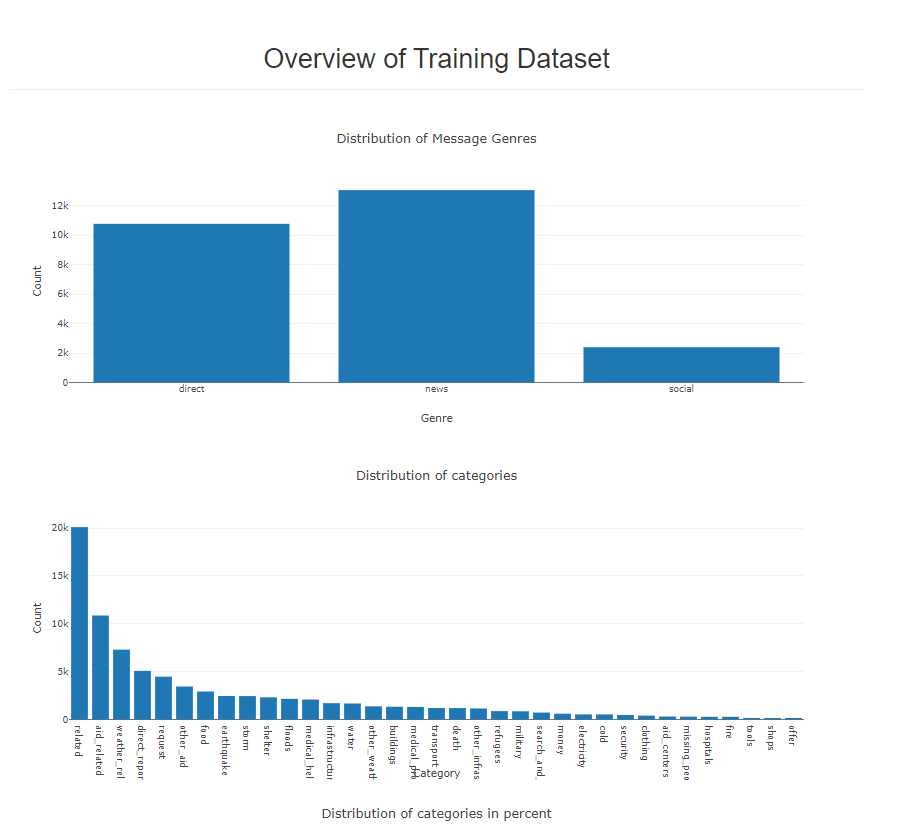
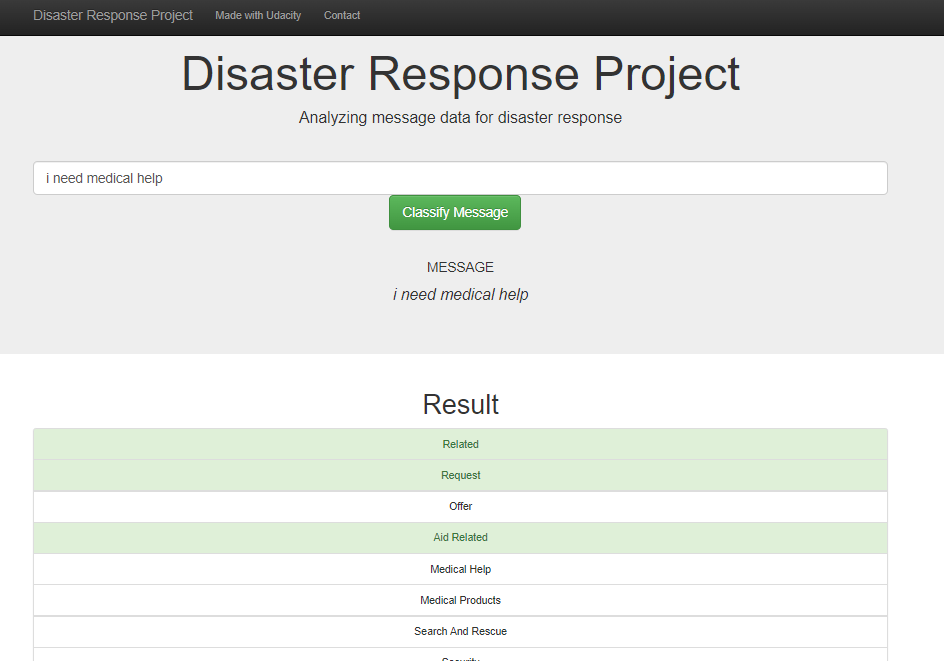

# Disaster Response Pipeline Project

### Instructions:
1. Run the following commands in the project's root directory to set up your database and model.

    - To run ETL pipeline that cleans data and stores in database
        `python data/process_data.py data/disaster_messages.csv data/disaster_categories.csv data/DisasterResponse.db`
    - To run ML pipeline that trains classifier and saves
        `python models/train_classifier.py data/DisasterResponse.db models/classifier.pkl`

2. Run the following command in the app's directory to run your web app.
    `python run.py`

3. Go to http://0.0.0.0:3001/

### Data used in this study

The data used are from Appen (formerly Figure 8)

### Libraries used

I've used common python libraries like : pandas, nltk, sklearn and plotly. All the libraries are available in the requirements.txt file.

### File Description

   - Folder data : contains data (*.csv) and process_data.py  --> This python file will act as an ETL and create a db file.
   - Folder models : contains train_classifier.py --> This file will train a model and create the model file.
   - Folder app : contains run.py --> This file will run a web dashboard.

### Examples

#### Overview
On the main page of the dashboard you can check for training data

You can also write a sentence and view the results of the prediction 
